# OKX 合约量化交易系统设计文档

版本：v0.2  
日期：2026-06-03  
项目类型：个人自用 OKX USDT 永续合约量化交易系统  
策略语言：Python  
首期交易范围：OKX SWAP / USDT 本位 / 逐仓 / 低杠杆 / BTC、ETH 优先

> 本文档用于指导后续开发，不构成投资建议。合约交易存在爆仓风险，本系统第一优先级是数据可靠、风控可靠、执行可恢复。

---

## 1. 项目定位

本项目要实现一个个人自用的 OKX 合约量化交易系统。它不是高频抢单系统，也不是商业化多用户平台。第一版目标是把量化交易的基础闭环做稳：

```text
数据采集 -> 本地数据仓库 -> Python 策略 -> 回测 -> 模拟盘 -> 风控 -> 小资金实盘 -> 监控告警
```

第一版只做：

- OKX API
- USDT 永续合约
- Python 策略
- 本地历史数据
- K 线级别策略
- 回测
- 模拟盘 / dry-run
- 小资金实盘
- 风控和订单对账

第一版不做：

- 多交易所
- 多用户系统
- 高频盘口抢单
- 复杂强化学习实盘
- 跨交易所套利
- 商业化 Web 平台
- 无限制网格或马丁格尔

---

## 2. 核心设计原则

### 2.1 数据优先

量化系统最重要的不是先写策略，而是先保证数据可靠。

本项目必须先建立本地数据仓库。策略、回测、模拟盘和实盘默认读取本地标准化数据，不应该每次临时依赖 OKX API。

核心要求：

- K 线时间戳连续
- 只使用已确认 K 线
- 历史数据支持补洞
- 本地多周期聚合可控
- 回测计入手续费、滑点和资金费率
- 实盘与回测的数据口径尽量一致

### 2.2 策略只产生信号

策略不能直接下单，不能直接访问 OKX API，不能直接设置杠杆，不能直接修改持仓。

正确链路：

```text
StrategyInstance
-> Signal
-> PortfolioRiskManager
-> SymbolLeaseManager
-> OrderIntent
-> OrderManager
-> OKXGateway
-> OKX
```

这样可以保证所有交易都经过统一风控和统一执行。

### 2.3 回测、模拟盘、实盘同构

策略接口在三种模式下保持一致：

```text
Backtest mode
Simulation mode
Live mode
```

三种模式只替换执行环境：

```text
BacktestBroker / SimulationBroker / LiveBroker
```

策略本身不应该知道当前是真实下单还是模拟下单。

### 2.4 一个账户一个中心执行器

第一版推荐：

```text
一个 OKX 子账户
一个 Bot
多个 StrategyInstance
一个 PortfolioRiskManager
一个 OrderManager
```

不要让多个独立机器人共用同一个 API key 和同一个账户直接下单。

### 2.5 实盘必须可恢复

程序重启、网络断开、WebSocket 断线后，系统必须能恢复账户状态。

每次启动和每轮主循环都要对账：

```text
本地订单
OKX 未完成订单
OKX 历史订单
OKX 当前持仓
OKX 成交记录
```

---

## 3. 对象层级

### 3.1 总层级

系统对象层级如下：

```text
Account
└── Bot
    ├── PortfolioRiskManager
    ├── OrderManager
    ├── PositionManager
    └── StrategyInstance
        └── Symbol / Instrument
```

一句话：

```text
账户是资金单位，Bot 是执行单位，策略实例是信号单位，合约币种是交易单位。
```

### 3.2 Account

`Account` 是资金和风险边界。

示例：

```text
account_id: okx_sub_main
exchange: OKX
account_type: sub-account
market: SWAP
margin_ccy: USDT
default_margin_mode: isolated
max_daily_loss: 3%
max_total_drawdown_pause: 8%
```

职责：

- 保存 API key 所属账户信息
- 定义账户级最大风险
- 汇总账户权益、余额、保证金和持仓
- 作为多个策略共享资金时的最终风控边界

### 3.3 Bot

`Bot` 是交易执行引擎。一个 Bot 负责一个账户中的策略调度、行情更新、风控、下单和对账。

示例：

```text
bot_id: okx_perp_bot_main
account_id: okx_sub_main
mode: simulation / live
loop_interval: 5s
```

职责：

- 加载配置
- 同步账户、持仓、订单
- 调度策略实例
- 收集策略信号
- 调用组合风控
- 生成订单意图
- 执行下单与撤单
- 对账并写日志

### 3.4 StrategyInstance

`StrategyInstance` 是策略运行单元。一个策略类可以实例化多次，用于不同币种、周期或参数。

示例：

```text
strategy_id: btc_trend_15m
strategy_class: MultiTimeframeTrendStrategy
symbol: BTC-USDT-SWAP
timeframe: 15m
higher_timeframe: 1h
risk_budget: 0.5%
status: active
```

职责：

- 读取市场数据
- 读取当前持仓上下文
- 产生 Signal
- 不直接下单
- 不直接访问 OKX API

### 3.5 Symbol / Instrument

`Symbol` 是交易对象，对应 OKX 的 `instId`。

示例：

```text
BTC-USDT-SWAP
ETH-USDT-SWAP
SOL-USDT-SWAP
```

系统必须缓存 instrument 规格：

- tick size
- lot size
- min size
- contract value
- quote currency
- instrument state
- supported order types

### 3.6 SymbolLease

`SymbolLease` 用于避免多个策略同时控制同一个合约。

规则：

```text
同一账户内，同一个 symbol 同一时间只能有一个主策略拥有开仓权。
多个策略可以观察同一个 symbol。
平仓权可以属于 owner strategy、RiskManager 或 CircuitBreaker。
紧急风控永远高于策略。
```

示例：

```text
symbol: BTC-USDT-SWAP
owner_strategy_id: btc_trend_15m
can_open: true
can_close: true
status: active
```

---

## 4. 推荐运行模型

### 4.1 第一阶段运行模型

```text
Account:
  okx_sub_main

Bot:
  okx_perp_bot_main

StrategyInstances:
  btc_trend_15m -> BTC-USDT-SWAP
  eth_trend_15m -> ETH-USDT-SWAP

Risk:
  max_risk_per_trade = 0.5%
  max_open_positions = 2
  max_leverage = 3
  max_daily_loss = 3%
```

### 4.2 第二阶段运行模型

```text
Account:
  okx_sub_main

Bot:
  okx_perp_bot_main

StrategyInstances:
  btc_trend_15m -> BTC-USDT-SWAP
  eth_trend_15m -> ETH-USDT-SWAP
  sol_trend_15m -> SOL-USDT-SWAP
  funding_filter -> all symbols observe only

Risk:
  strategy-level risk budget
  symbol-level exposure cap
  account-level drawdown cap
```

### 4.3 多 Bot 模型

多 Bot 必须优先用 OKX 子账户隔离：

```text
Sub-account A -> Bot A -> 主趋势策略
Sub-account B -> Bot B -> 统计套利策略
Sub-account C -> Bot C -> 实验策略
```

不推荐：

```text
Bot A -> 同一个 API key -> 同一个账户
Bot B -> 同一个 API key -> 同一个账户
Bot C -> 同一个 API key -> 同一个账户
```

原因：

- 多个 Bot 会争抢同一份保证金
- Bot 之间不知道对方仓位
- 可能互相平仓
- 可能重复开仓
- 订单对账混乱
- 风控无法统一

---

## 5. 总体架构

```mermaid
flowchart TD
  A["Config / Secrets"] --> B["TradeEngine"]

  B --> C["OKXGateway"]
  C --> C1["REST Client"]
  C --> C2["Public WebSocket"]
  C --> C3["Private WebSocket"]

  B --> D["MarketDataService"]
  D --> D1["Historical Candle Sync"]
  D --> D2["Realtime Candle Update"]
  D --> D3["Funding Rate"]
  D --> D4["Mark / Index Price"]
  D --> D5["OrderBook Provider"]

  B --> E["StrategyService"]
  E --> E1["StrategyRegistry"]
  E --> E2["StrategyRunner"]
  E --> E3["MarketRegimeDetector"]
  E --> E4["StrategyRouter"]

  B --> F["RiskService"]
  F --> F1["PortfolioRiskManager"]
  F --> F2["PositionRiskManager"]
  F --> F3["CircuitBreaker"]
  F --> F4["SymbolLeaseManager"]

  B --> G["ExecutionService"]
  G --> G1["OrderFactory"]
  G --> G2["OrderManager"]
  G --> G3["PositionManager"]
  G --> G4["Reconciliation"]

  B --> H["BacktestService"]
  H --> H1["BacktestEngine"]
  H --> H2["SimulationBroker"]
  H --> H3["WalkForwardValidator"]
  H --> H4["OverfitAnalyzer"]

  B --> I["Storage"]
  I --> I1["PostgreSQL"]
  I --> I2["Market Data Tables"]
  I --> I3["Trade Journal"]

  B --> J["API / Dashboard / Alerts"]
```



---

## 6. 模块职责

### 6.1 OKXGateway

职责：

- OKX REST 鉴权
- 查询账户
- 查询持仓
- 查询订单
- 查询成交
- 查询 instruments
- 查询历史 K 线
- 设置杠杆
- 下单
- 撤单
- 改单
- 订阅 public WebSocket
- 订阅 private WebSocket

第一版默认：

```text
instType = SWAP
margin_ccy = USDT
tdMode = isolated
position_mode = net
```

OKX 合约细节必须封装在 gateway 和 mapper 内，不暴露给策略层。

### 6.2 MarketDataService

职责：

- 历史 K 线分页回填
- K 线本地存储
- K 线缺口检测
- 1m 聚合 5m / 15m / 1h
- funding rate 同步
- mark price / index price 同步
- 实时行情更新
- 为策略提供标准化数据

策略默认读取已确认 K 线：

```text
confirm = 1
```

未确认 K 线只能被显式声明支持的策略使用。

### 6.3 StrategyService

职责：

- 加载策略类
- 创建策略实例
- 注入策略上下文
- 调用策略生成信号
- 收集策略信号
- 记录策略运行日志

策略接口示例：

```python
class BaseStrategy:
    strategy_id: str
    symbols: list[str]
    timeframe: str

    def on_candles(self, context, candles):
        return []

    def on_position(self, context, position):
        return []
```

### 6.4 RiskService

职责：

- 账户级风险控制
- 策略级风险预算
- 币种级仓位限制
- 单笔风险计算
- 杠杆限制
- 日亏损限制
- 连续亏损暂停
- 熔断
- SymbolLease 检查

风控输出：

```python
class RiskDecision:
    approved: bool
    reason: str
    original_size: Decimal
    adjusted_size: Decimal
    max_loss_usdt: Decimal
    leverage: int
```

### 6.5 ExecutionService

职责：

- 把 Signal 转成 OrderIntent
- 生成 client_order_id
- 根据合约规格修正价格和数量精度
- 执行下单
- 执行撤单
- 处理部分成交
- 处理订单超时
- 维护本地订单状态
- 对账 OKX 订单和持仓

### 6.6 BacktestService

职责：

- 使用本地历史数据回测
- 模拟手续费
- 模拟滑点
- 模拟资金费率
- 模拟逐仓风险
- 计算收益指标
- 生成交易记录
- 支持 walk-forward
- 支持参数稳定性检查

### 6.7 API / Dashboard / Alerts

第一版可以先做 API 和日志，不急着做复杂前端。

最小能力：

- 查看账户状态
- 查看持仓
- 查看订单
- 查看策略状态
- 查看最近信号
- 手动暂停 Bot
- 手动暂停某个策略
- 手动紧急平仓
- 发送异常告警

---

## 7. 数据架构

### 7.1 OKX K 线限制与解决方案

OKX 当前文档显示：

- `GET /api/v5/market/candles` 默认返回 100 条，`limit` 最大 300。
- `GET /api/v5/market/history-candles` 用于历史 K 线。
- 历史 K 线接口需要分页拉取，并遵守接口频率限制。

解决方案：

```text
OKX REST history-candles
-> 分页回填历史数据
-> upsert 到本地 candles 表
-> 缺口检测
-> REST 补洞
-> WebSocket / REST 增量更新
-> 策略和回测只读本地标准化数据
```

### 7.2 历史 K 线同步流程

输入：

```text
symbol = BTC-USDT-SWAP
timeframe = 1m
start_time = 2023-01-01
end_time = now
limit = 300
```

流程：

```text
1. 查询本地同步状态。
2. 使用 history-candles 分页拉取。
3. 每批数据标准化 timestamp、open、high、low、close、volume、confirm。
4. 只保存 confirm=1 的已确认 K 线。
5. 使用 symbol + timeframe + timestamp 做唯一键 upsert。
6. 每批请求后经过 RateLimiter。
7. 同步完成后执行连续性检查。
8. 缺失区间写入 missing_ranges。
9. 定时补洞。
```

伪代码：

```python
while cursor_not_reached_start:
    batch = okx.get_history_candles(
        inst_id=symbol,
        bar=timeframe,
        after=cursor,
        limit=300,
    )
    candles = normalize_okx_candles(batch)
    confirmed = [c for c in candles if c.confirmed]
    candle_store.upsert_many(confirmed)
    cursor = oldest_timestamp(confirmed)
    rate_limiter.sleep()
```

### 7.3 本地多周期聚合

第一版建议优先保存：

```text
1m K 线
```

然后从本地 1m 聚合：

```text
1m -> 5m
1m -> 15m
1m -> 1h
1m -> 4h
```

优点：

- 减少 OKX API 请求
- 多周期对齐由本地控制
- 回测和实盘口径一致
- 更容易发现缺口

同时，系统应定期用 OKX 官方 5m / 1h K 线抽样对照，验证本地聚合没有偏差。

### 7.4 数据完整性检查

每个 `symbol + timeframe` 维护同步状态：

```text
first_ts
last_ts
expected_count
actual_count
missing_ranges
last_sync_at
source
```

检查规则：

```text
1m: 相邻 timestamp 差 60 秒
5m: 相邻 timestamp 差 300 秒
15m: 相邻 timestamp 差 900 秒
1h: 相邻 timestamp 差 3600 秒
```

### 7.5 第一版必需数据

必须采集：

- OHLCV K 线
- instrument specs
- funding rate
- mark price
- index price
- account snapshots
- orders
- fills
- positions

第二版再加入：

- orderbook top 5 / 20 / 400
- trades
- open interest
- liquidation data

---

## 8. 核心数据模型

### 8.1 Signal

```python
class Signal:
    signal_id: str
    account_id: str
    bot_id: str
    strategy_id: str
    symbol: str
    action: str  # open, close, reduce, hold
    direction: str  # long, short, neutral
    confidence: float
    timeframe: str
    reason: str
    stop_loss_pct: float | None
    take_profit_pct: float | None
    created_at: datetime
```

### 8.2 OrderIntent

```python
class OrderIntent:
    account_id: str
    bot_id: str
    strategy_id: str
    symbol: str
    side: str  # buy, sell
    position_action: str  # open, close, reduce
    order_type: str  # market, limit, post_only
    size: Decimal
    price: Decimal | None
    reduce_only: bool
    client_order_id: str
```

### 8.3 Order

```python
class Order:
    order_id: str
    okx_order_id: str | None
    client_order_id: str
    account_id: str
    bot_id: str
    strategy_id: str
    symbol: str
    side: str
    order_type: str
    size: Decimal
    filled_size: Decimal
    price: Decimal | None
    avg_fill_price: Decimal | None
    status: str
    created_at: datetime
    updated_at: datetime
```

### 8.4 Position

```python
class Position:
    account_id: str
    symbol: str
    direction: str
    size: Decimal
    entry_price: Decimal
    mark_price: Decimal
    unrealized_pnl: Decimal
    liquidation_price: Decimal | None
    margin_mode: str
    leverage: int
    updated_at: datetime
```

### 8.5 数据库核心表

```text
accounts
bots
strategy_instances
symbol_leases
instruments
candles
funding_rates
mark_prices
account_snapshots
positions
orders
fills
signals
risk_decisions
backtest_runs
backtest_trades
backtest_metrics
system_events
```

所有交易相关表必须包含：

```text
account_id
bot_id
strategy_id
symbol
run_id
```

---

## 9. 交易生命周期

### 9.1 主循环

第一版采用主循环，不做纯事件驱动。

```text
每 3-10 秒：
1. 同步账户状态
2. 同步持仓
3. 同步未完成订单
4. 更新行情缓存
5. 检查 K 线是否产生新确认 candle
6. 调用策略实例
7. 收集 Signal
8. 执行组合风控
9. 检查 SymbolLease
10. 生成 OrderIntent
11. 执行下单或撤单
12. 对账订单和持仓
13. 写入数据库和日志
14. 触发告警
```

### 9.2 下单生命周期

```text
Signal
-> RiskDecision
-> OrderIntent
-> Local Pending Order
-> OKX Place Order
-> OKX Order Accepted
-> Fill / Partial Fill / Canceled / Rejected
-> Position Update
-> Reconciliation
```

### 9.3 client_order_id 规则

`client_order_id` 必须可追踪来源：

```text
{bot_short}-{strategy_short}-{symbol_short}-{timestamp}-{seq}
```

示例：

```text
main-btcTrend-BTC-20260603T130501-000001
```

用途：

- 防重复下单
- 对账时识别订单来源
- 异常恢复时重建订单关系

---

## 10. 风控设计

### 10.1 必备规则

第一版必须实现：

```text
单笔最大亏损
账户最大日亏损
账户最大回撤暂停
最大杠杆
最大同时持仓数
单 symbol 最大仓位
单策略风险预算
禁止无止损开仓
禁止重复开仓
连续亏损冷却
低流动性禁止交易
极端 funding rate 限制
reduce-only 保护
紧急熔断
```

### 10.2 推荐默认值

```text
max_risk_per_trade = 0.5%
max_daily_loss = 3%
max_total_drawdown_pause = 8%
max_leverage = 3
max_open_positions = 2
cooldown_after_loss = 30 minutes
```

### 10.3 风控优先级

```text
CircuitBreaker
> AccountRisk
> PositionRisk
> SymbolLease
> StrategySignal
```

如果风控和策略冲突，永远听风控。

---

## 11. 策略设计

### 11.1 第一版推荐策略

第一版推荐：

```text
多周期趋势突破策略
```

配置：

```text
symbols: BTC-USDT-SWAP, ETH-USDT-SWAP
timeframe: 15m
higher_timeframe: 1h / 4h
leverage: 1-3x
risk_per_trade: 0.5%
stop_loss: ATR-based
take_profit: 1.5R - 3R 或移动止盈
filters: volatility, volume, funding rate
```

示例逻辑：

```text
1. 4h EMA200 判断大方向。
2. 1h EMA50 判断中期趋势。
3. 15m 突破前高或回踩均线后入场。
4. ATR 设置止损。
5. 单笔最大亏损控制在账户权益 0.5%。
6. funding rate 极端时不开不利方向仓位。
7. 连续亏损后暂停。
```

### 11.2 策略路线

推荐顺序：

```text
1. 多周期趋势突破
2. 趋势 + 市场状态过滤
3. 趋势 + funding rate 过滤
4. 均值回归，仅用于震荡市场
5. 统计套利 / pair trading
6. 盘口 / orderbook 研究
7. 强化学习实验
```

### 11.3 暂不推荐

第一版不推荐：

- 复杂 RL
- LSTM / Transformer 直接预测涨跌
- 高频做市
- 高杠杆网格
- 马丁格尔
- 跨交易所套利
- 只靠 TradingView 公开脚本

### 11.4 策略来源

策略研究来源：

- Freqtrade strategies: https://github.com/freqtrade/freqtrade-strategies
- Freqtrade strategy docs: https://docs.freqtrade.io/en/stable/strategy-customization/
- QuantConnect Crypto Futures: https://www.quantconnect.com/docs/v2/research-environment/datasets/crypto-futures
- arXiv / SSRN
- TradingView / Pine Script
- GitHub

推荐搜索关键词：

```text
cryptocurrency trend following
crypto futures funding rate
perpetual futures basis
cryptocurrency statistical arbitrage
crypto market regime detection
crypto backtest overfitting
freqtrade strategy
```

---

## 12. 回测与验证

### 12.1 上线前验证流程

```text
历史回测
-> 样本外测试
-> walk-forward
-> 参数稳定性测试
-> simulation trading 7-30 天
-> 小资金实盘
-> 扩大资金
```

### 12.2 回测必须计入

- 手续费
- 滑点
- 资金费率
- mark price
- 逐仓保证金
- 止损触发逻辑
- 部分成交模拟，第二版再做

### 12.3 策略上线标准

策略上线前必须满足：

```text
至少 6-12 个月历史回测
样本外表现不过度退化
参数轻微变化后结果不崩
最大回撤可接受
手续费和滑点后仍有正期望
dry-run 至少 7-30 天
有自动熔断
```

---

## 13. 延迟与开单频率

### 13.1 系统定位

第一版不是毫秒级系统，而是：

```text
分钟级 / 多分钟级 / 小时级合约策略系统
```

推荐周期：

```text
5m
15m
1h
4h
```

### 13.2 开单频率预期

如果只交易 BTC/ETH，使用 15m 或 1h 策略：

```text
每天 0-10 单都正常
```

开单量由以下因素决定：

- 交易周期
- 信号阈值
- 交易币种数量
- 是否允许做空
- 风控强度
- funding rate 过滤
- 市场状态过滤

第一版不要追求高开单量。应该先追求：

```text
信号质量
数据准确
止损可靠
手续费可控
回撤可控
```

### 13.3 执行延迟控制

第一版措施：

- public WebSocket 更新行情
- private WebSocket 监听订单、成交、持仓
- REST 定期对账
- 本地缓存 instrument specs
- 本地提前计算价格和数量精度
- 使用 client_order_id 幂等
- 主循环 3-10 秒

---

## 14. 推荐目录结构

```text
trade/
  app/
    main.py
    config.py
    logging.py

  core/
    engine.py
    clock.py
    models.py
    enums.py
    events.py

  exchanges/
    base.py
    okx/
      gateway.py
      rest.py
      websocket_public.py
      websocket_private.py
      signer.py
      mapper.py

  market_data/
    provider.py
    candle_sync.py
    candle_store.py
    realtime_candles.py
    funding.py
    instruments.py
    orderbook.py

  strategies/
    base.py
    context.py
    registry.py
    router.py
    examples/
      ma_cross.py
      breakout.py
      funding_filter_trend.py

  regime/
    detector.py
    trend.py
    volatility.py
    liquidity.py

  risk/
    manager.py
    rules.py
    sizing.py
    liquidation.py
    circuit_breaker.py
    symbol_lease.py

  execution/
    order_factory.py
    order_manager.py
    position_manager.py
    reconciliation.py

  backtest/
    engine.py
    simulator.py
    metrics.py
    walk_forward.py
    overfit.py

  simulation/
    broker.py
    simulator.py

  storage/
    db.py
    models.py
    repositories.py

  api/
    server.py
    routes/
      account.py
      positions.py
      orders.py
      strategies.py
      backtests.py

  research/
    research_notes/
    strategy_notes/
    experiments/

  tests/
```

---

## 15. 开发路线

### Phase 1：项目骨架

目标：建立可运行的 Python 项目结构。

任务：

- 创建目录结构
- 配置 Python 环境
- 定义配置文件
- 定义核心枚举和数据模型
- 建立日志系统
- 建立测试框架

完成标准：

```text
项目可以启动
基础测试可以运行
核心模型可以导入
```

### Phase 2：OKX 基础连接

目标：能安全访问 OKX 基础接口。

任务：

- OKX REST 签名
- 查询 server time
- 查询 instruments
- 查询账户
- 查询持仓
- 查询历史 K 线

完成标准：

```text
可以读取 OKX instruments
可以读取 BTC-USDT-SWAP K 线
可以标准化返回数据
```

### Phase 3：本地数据仓库

目标：历史数据可以稳定回填、存储、检查。

任务：

- candles 表
- instruments 表
- funding_rates 表
- K 线分页同步
- 缺口检测
- 1m 聚合 5m / 15m / 1h

完成标准：

```text
可以回填 BTC/ETH 1m K 线
可以检查缺口
可以生成 15m K 线
```

### Phase 4：策略接口与第一个策略

目标：策略可以读取本地数据并产生信号。

任务：

- BaseStrategy
- StrategyContext
- Signal
- StrategyRunner
- 多周期趋势突破策略

完成标准：

```text
策略可以在历史 candles 上输出 Signal
Signal 被记录到数据库或日志
```

### Phase 5：回测

目标：策略可以完整回测。

任务：

- BacktestEngine
- 手续费模型
- 滑点模型
- funding fee 模型
- 回测指标
- 回测交易记录

完成标准：

```text
可以对 BTC/ETH 趋势策略生成回测报告
报告包含收益、回撤、胜率、交易次数、手续费
```

### Phase 6：模拟盘

目标：使用实时行情运行策略但不真实下单。

任务：

- SimulationBroker
- 模拟订单
- 模拟持仓
- 模拟成交
- 策略运行日志

完成标准：

```text
策略可以 dry-run 运行
系统可以展示模拟持仓和订单
```

### Phase 7：风控与执行

目标：所有订单意图必须经过风控和统一执行。

任务：

- PortfolioRiskManager
- SymbolLeaseManager
- OrderIntent
- OrderFactory
- OrderManager
- PositionManager
- Reconciliation

完成标准：

```text
Signal 不能绕过风控直接下单
订单有 client_order_id
本地订单和持仓可以对账
```

### Phase 8：小资金实盘

目标：低杠杆、小资金真实交易。

任务：

- OKX 下单
- OKX 撤单
- private WebSocket
- 成交同步
- 持仓同步
- 异常告警
- 紧急暂停

完成标准：

```text
可以用极小仓位完成开仓、平仓、撤单、对账
异常时可以暂停交易
```

### Phase 9：研究增强

目标：提高策略筛选和稳定性。

任务：

- walk-forward
- overfit analyzer
- MarketRegimeDetector
- StrategyRouter
- funding filter
- 统计套利实验
- orderbook 数据研究

---

## 16. 外部参考

### 16.1 Freqtrade

可学习点：

- 策略接口标准化
- dry-run
- 回测和实盘共用策略
- exchange 层封装
- DataProvider
- Protection / Risk

参考：

- https://github.com/freqtrade/freqtrade
- https://docs.freqtrade.io/
- https://github.com/freqtrade/freqtrade-strategies

### 16.2 OKX API

参考：

- https://www.okx.com/docs-v5/en/
- https://app.okx.com/docs-v5/en/
- https://app.okx.com/docs-v5/zh

关注点：

- `tdMode`
- `posSide`
- position mode
- leverage
- reduce-only
- client order id
- REST rate limit
- WebSocket reconnect
- candles pagination

### 16.3 研究方向

可吸收的研究思想：

- 回测过拟合检测
- walk-forward
- 市场状态识别
- 策略路由
- 盘口数据
- funding rate / basis
- 统计套利

参考：

- https://arxiv.org/abs/2209.05559
- https://arxiv.org/abs/2309.12891
- https://arxiv.org/abs/2305.15821
- https://arxiv.org/abs/2410.14504

---

## 17. 下一步开发入口

下一步建议从 Phase 1 开始，不要直接写策略。

第一批代码目标：

```text
1. 创建 Python 项目结构
2. 定义核心模型：Account、Bot、StrategyInstance、Signal、OrderIntent、Order、Position
3. 实现配置加载
4. 实现 OKX REST 基础 client
5. 实现查询 instruments 和 candles
6. 实现 candles 本地存储设计
```

开发顺序原则：

```text
先数据
再策略
再回测
再模拟盘
再实盘
```
