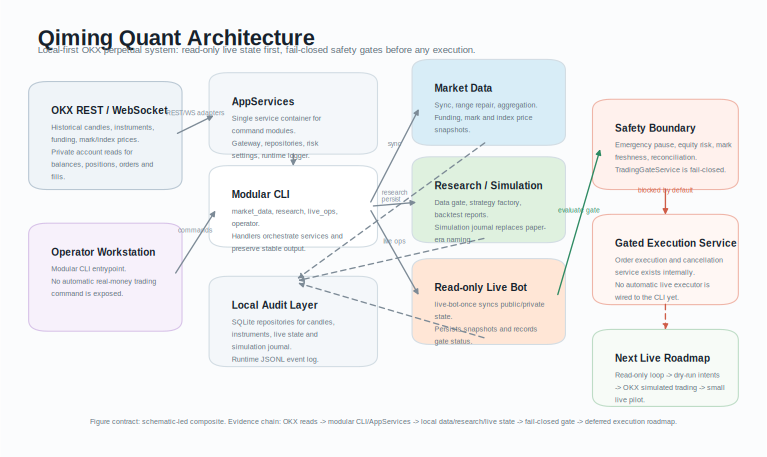

# Qiming Quant

Independent personal OKX USDT perpetual contract quant trading system.

Current status: early development system with OKX API Gateway foundations, live state message handling, data sync, local candle storage, strategy signal generation, risk checks, simulated fills, backtesting, live reconciliation, live equity risk gating, live fill persistence, and gated live order execution/cancellation services. Phase 1 exposes a demo-only OKX place/cancel CLI.

Design docs:

- [PROJECT_DESIGN.md](PROJECT_DESIGN.md): system architecture and development phases
- [STRATEGY_RESEARCH.md](STRATEGY_RESEARCH.md): OKX perpetual strategy mining roadmap

## Architecture



Data first. Local audit. Fail closed. No automatic live trading until readiness checks pass.

## Safety Boundary

This project currently supports OKX market/account reads, local simulation/backtesting, live state persistence for tickers, balances, positions, orders, and fills, reconciliation, live equity drawdown checks, emergency pause controls, and gated internal live order execution/cancellation services.

The OKX integration is organized as an API Gateway:

- REST API: historical candles, instruments, funding rates, account queries, position queries, pending-order queries, REST reconciliation, order placement, and order cancellation.
- WebSocket API: public/private URL, private login message signing, subscribe/unsubscribe message construction, message dispatch, reconnect subscription replay, a `websockets` network adapter, and normalized live state handling for tickers, account balances, positions, orders, and fills are implemented as tested foundations. An always-on live sync loop is intentionally not started yet.

Still intentionally not exposed:

- A CLI command for real-money live order placement
- An always-on live trading loop
- A production scheduler/daemon
- Full private fill-event lifecycle reconciliation

Do not expose live trading until data sync, backtesting, simulation, risk checks, reconciliation, small-size constraints, and operator emergency controls are reviewed together.

## Setup

Use Python 3.11+.

```powershell
python -m pytest -q
python -m ruff check .
```

Local acceptance smoke test:

```powershell
python scripts/local_acceptance_check.py
```

Phase 1 acceptance smoke test:

```powershell
python -m pytest tests/test_phase1_cli.py -q
```

Phase 2 local strategy-loop smoke test:

```powershell
python scripts/phase2_basic_strategy_loop_check.py
```

Local data quality smoke test:

```powershell
python scripts/data_quality_check.py
```

Phase 3 local risk-controls smoke test:

```powershell
python scripts/phase3_risk_controls_check.py
```

Pre-live order dry-run smoke test:

```powershell
python scripts/prelive_order_check.py
```

Phase 4 local monitoring smoke test:

```powershell
python scripts/phase4_monitoring_check.py
```

Optional environment variables:

```powershell
$env:OKX_API_KEY = "..."
$env:OKX_SECRET_KEY = "..."
$env:OKX_PASSPHRASE = "..."
$env:OKX_SIMULATED_TRADING = "1"
$env:DATABASE_URL = "sqlite:///trade.db"
$env:DEFAULT_SYMBOLS = "BTC-USDT-SWAP,ETH-USDT-SWAP"
$env:MAX_RISK_PER_TRADE = "0.005"
$env:MAX_DAILY_LOSS = "0.03"
$env:MAX_TOTAL_DRAWDOWN_PAUSE = "0.08"
$env:MAX_LEVERAGE = "3"
$env:MAX_OPEN_POSITIONS = "2"
$env:MAX_MARK_PRICE_AGE_SECONDS = "120"
$env:RUN_LOG_PATH = "logs/qiming-events.jsonl"
```

Public data commands do not require OKX credentials.

Phase 1 OKX demo order CLI:

```powershell
python -m app.phase1_cli auth
python -m app.phase1_cli place --symbol BTC-USDT-SWAP --side buy --size 0.01 --client-order-id phase1-test
python -m app.phase1_cli cancel --symbol BTC-USDT-SWAP --client-order-id phase1-test
```

The Phase 1 CLI requires `OKX_SIMULATED_TRADING=1` and refuses to run without OKX credentials.

Phase 1 auth/place/cancel verification script:

```powershell
python scripts/phase1_place_cancel_check.py
```

## CLI

List instruments:

```powershell
python -m app.main instruments --inst-type SWAP
```

Sync instruments into the local database:

```powershell
python -m app.main sync-instruments --inst-type SWAP
```

Sync historical candles:

```powershell
python -m app.main sync-candles --symbol BTC-USDT-SWAP --timeframe 1m --pages 1
```

Sync historical candles by an explicit time range:

```powershell
python -m app.main sync-candles-range --symbol BTC-USDT-SWAP --timeframe 1m --start 2024-01-01T00:00:00Z --end 2024-01-02T00:00:00Z
```

This command uses the OKX paginated range fetcher, so it can cover ranges larger than a single OKX response page.

Sync funding-rate history into the local database:

```powershell
python -m app.main sync-funding-rates --symbol BTC-USDT-SWAP --limit 100
```

Sync current mark-price snapshots into the local database:

```powershell
python -m app.main sync-mark-prices --symbol BTC-USDT-SWAP
```

Sync current index-price snapshots into the local database:

```powershell
python -m app.main sync-index-prices --quote-currency USDT
```

Check local candle coverage and gap status:

```powershell
python -m app.main candle-state --symbol BTC-USDT-SWAP --timeframe 1m
```

Repair missing local candle ranges:

```powershell
python -m app.main repair-missing --symbol BTC-USDT-SWAP --timeframe 1m
```

Aggregate locally stored 1m candles into a higher timeframe:

```powershell
python -m app.main aggregate-candles --symbol BTC-USDT-SWAP --source-timeframe 1m --target-timeframe 15m
```

Run the starter trend backtest from locally stored candles:

```powershell
python -m app.main backtest --symbol BTC-USDT-SWAP --timeframe 15m
python -m app.main backtest --symbol BTC-USDT-SWAP --timeframe 15m --strategy ma-crossover
```

Run a backtest on a specific local data slice:

```powershell
python -m app.main backtest --symbol BTC-USDT-SWAP --timeframe 15m --start 2024-01-01T00:00:00Z --end 2024-03-01T00:00:00Z
```

Save a structured JSON backtest report:

```powershell
python -m app.main backtest --symbol BTC-USDT-SWAP --timeframe 15m --report-json reports/btc_15m_backtest.json
```

When `--report-json` is provided, blocked backtests also write a JSON report with the data-gate reason, so batch research runs can track skipped windows.

Backtest JSON reports include a `funding_rates` summary when a local funding-rate repository is available. This records the funding-rate window, count, average, min, max, and first/last funding timestamps, giving futures strategy research context before funding filters are added to strategy logic.

`backtest` blocks by default when local candles are empty, contain timestamp gaps, or have fewer than 30 candles. Use `candle-state` and `repair-missing` first. For research-only experiments where gaps are intentional, pass `--allow-gaps`. For quick smoke tests with shorter samples, pass `--min-candles`.

When local instrument specs have been synced, `backtest` uses the stored tick size, lot size, and minimum size for order intent quantization. If specs are missing, it falls back to conservative defaults.

Run the starter strategy through the local simulation loop:

```powershell
python -m app.main sim-run --symbol BTC-USDT-SWAP --timeframe 15m
python -m app.main sim-run --symbol BTC-USDT-SWAP --timeframe 15m --strategy ma-crossover
```

`sim-run` also supports `--start` and `--end` for running a fixed local historical window.

`sim-run` uses the same candle data gate as `backtest`: empty, too-short, or gapped local candles are blocked unless the relevant override is passed. It also uses local instrument specs when available and includes the active tick, lot, and minimum sizes in its summary output. `paper-run` remains available as a compatibility alias, but `sim-run` is the preferred command.

Manually run read-only live state synchronization:

```powershell
python -m app.main live-sync --symbol BTC-USDT-SWAP --max-messages 1 --public-only
```

`live-sync` wires the OKX WebSocket runtime, network adapter, live state handler, and live state repository together. It can update and persist ticker, balance, position, order, and fill snapshots, but it does not place or cancel orders. Use `--public-only` for market-data smoke tests before running private account subscriptions.

Compare the local live snapshot with OKX REST state:

```powershell
python -m app.main live-reconcile --account-id okx_sub_main
```

`live-reconcile` checks local positions and active pending orders against OKX REST responses. Terminal local orders such as filled or canceled orders are ignored for pending-order comparison, and active orders can match by either OKX order id or client order id. A non-clean report is treated as fail-closed: `trading_allowed=false`.

Evaluate the live trading safety gate:

```powershell
python -m app.main trading-gate --account-id okx_sub_main
```

The gate is fail-closed: manual emergency pause blocks first, then local USDT equity must be within the daily loss and total drawdown limits, then local mark-price snapshots must be fresh, then REST reconciliation must be clean before `trading_allowed=true`. Missing or invalid local equity snapshots block trading until a private live sync records account balances. Missing or stale mark-price snapshots block trading until `sync-mark-prices` refreshes them.

Dry-run a live order intent without placing it:

```powershell
python -m app.main live-order-check --symbol BTC-USDT-SWAP --side buy --position-action open --size 0.1
```

`live-order-check` builds an `OrderIntent` and evaluates the same local order policy and trading gate used by live execution, but it does not call OKX order placement. Invalid decimal inputs are rejected before policy checks, and market orders with `--price` are rejected by policy.
When local instrument specs are configured, live order checks also require a synced live instrument row and verify `size` against OKX `minSz` and `lotSz` before the trading gate runs. Run `sync-instruments` before using live checks or live execution.
If a local active live order already uses the same `client_order_id` for the same symbol, live checks fail with `duplicate_client_order_id` before the trading gate runs. This protects retries and restarts from submitting the same logical order twice.

Check local pre-live readiness:

```powershell
python -m app.main prelive-readiness
python -m app.main prelive-readiness --symbol BTC-USDT-SWAP --symbol ETH-USDT-SWAP
```

`prelive-readiness` is read-only and local-state based. It checks manual pause state, runtime log configuration, synced instrument specs, fresh mark-price snapshots, and a local USDT balance snapshot before live order checks or live execution are considered.

Manual emergency controls:

```powershell
python -m app.main emergency-pause --reason operator_stop
python -m app.main emergency-resume --reason operator_resume
```

Runtime audit log:

```powershell
python -m app.main operator-status
python -m app.main operator-status --include-gate
python -m app.main run-log-tail --limit 20
Get-Content logs/qiming-events.jsonl
```

`operator-status` summarizes manual pause state and the latest runtime event for quick server checks. By default it is a local-only pause/log check; use `--include-gate` when you also want to evaluate the trading gate, including REST reconciliation. The CLI writes JSONL runtime events for simulation runs, live sync/reconcile checks, trading-gate decisions, live order dry-runs, and manual emergency pause/resume commands. Set `RUN_LOG_PATH` to an empty value to disable this local audit log.

The codebase includes a minimal OKX REST order adapter and a live execution service that must pass local order policy and the trading gate before calling OKX. The default live order policy only allows BTC/ETH USDT swap market orders in isolated mode; open orders must not be reduce-only, while close/reduce orders must be reduce-only. Successful submissions are recorded into the local live order snapshot for restart recovery and reconciliation. If OKX returns a per-order rejection code, the service reports `exchange_rejected` and does not record a submitted local order. The same service can request cancellation by OKX order id or client order id and marks matching local orders as `cancel_requested` when OKX accepts the request; cancel rejections do not modify local order state. There is intentionally no real-money live order CLI yet; Phase 1 order placement is demo-only and requires `OKX_SIMULATED_TRADING=1`.
When OKX private WebSocket order updates arrive, the live state store preserves the original local `account_id`, `bot_id`, `strategy_id`, and `run_id` for matching `order_id` or `client_order_id`, so exchange lifecycle updates and derived fills do not erase strategy lineage.

The current backtest engine supports a single-position K-line lifecycle with:

- Entry from strategy `Signal`
- Confirmed-candle signals filled at the next candle open
- Stop-loss and take-profit exits
- Fee and slippage accounting
- Closed trade PnL
- Equity curve
- Win rate
- Maximum drawdown
- Gross profit/loss
- Profit factor and payoff ratio
- Maximum consecutive losses
- Average holding time

The current simulation loop supports:

- Strategy signal generation from local candles
- Confirmed-candle signals filled at the next candle open
- Portfolio risk approval/rejection
- Symbol lease checks
- Order intent creation
- Simulated market fills
- Simulated position tracking
- Stop-loss and take-profit exits from candle high/low
- Equity updates on simulated closes
- Simulation journal events
- Persistence of simulated fills, positions, and journal events

Saving a simulation run replaces the existing snapshot for that `run_id`, so closed positions from an older run are not restored as stale open positions.

The current reconciliation module supports fail-closed local-vs-exchange position checks:

- Missing local or exchange positions
- Size mismatch
- Direction mismatch
- Duplicate local or exchange position rows
- Malformed exchange position snapshots

Available example strategies:

- `MovingAverageCrossoverStrategy`: long-only fast/slow SMA crossover strategy for the basic local strategy loop
- `MultiTimeframeTrendStrategy`: long-only EMA trend strategy with optional higher-timeframe confirmation and ATR-based risk percentages
- `AtrChannelBreakoutStrategy`: long-only ATR Donchian/channel breakout strategy using confirmed OHLCV candles, recent ATR risk sizing, and ATR volatility bounds

The current portfolio risk manager enforces:

- Stop-loss required for open signals
- Per-trade risk sizing from equity, entry price, and stop distance
- Maximum open positions
- Duplicate symbol-open rejection
- Daily loss pause threshold
- Total drawdown pause threshold
- Close signals allowed without requiring a new entry price

The current order factory creates traceable `client_order_id` values with:

- Bot id
- Strategy id
- Symbol prefix
- UTC second timestamp
- Per-factory sequence suffix to avoid same-second collisions

It also quantizes order size/price using instrument specs and rejects orders whose quantized size is below `min_size`.

The current local storage layer supports:

- Candle upsert and sync-state tracking
- Local instrument specs with exact Decimal values stored as text to avoid SQLite precision noise
- Funding-rate history upsert and time-window reads for contract strategy research
- Mark-price and index-price snapshot upsert for contract risk and monitoring research
- Live ticker, balance, position, order, and fill snapshots for restart recovery research

## Development Order

1. Make OKX K-line sync robust.
2. Sync and validate local instrument specs.
3. Store and validate local market data.
4. Improve the starter strategy and backtest metrics.
5. Add simulation loop.
6. Add portfolio risk and reconciliation depth.
7. Add reconnecting live market/account state sync.
8. Only then add small-size live order placement.
